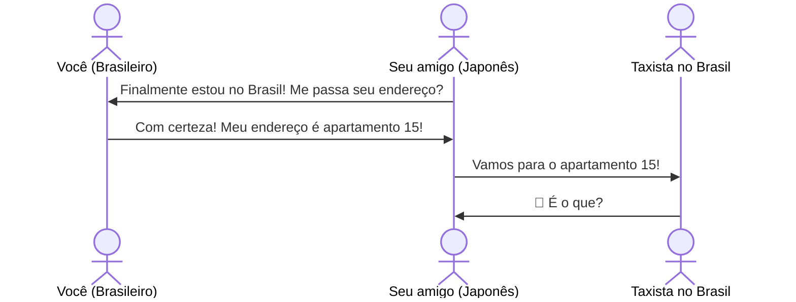
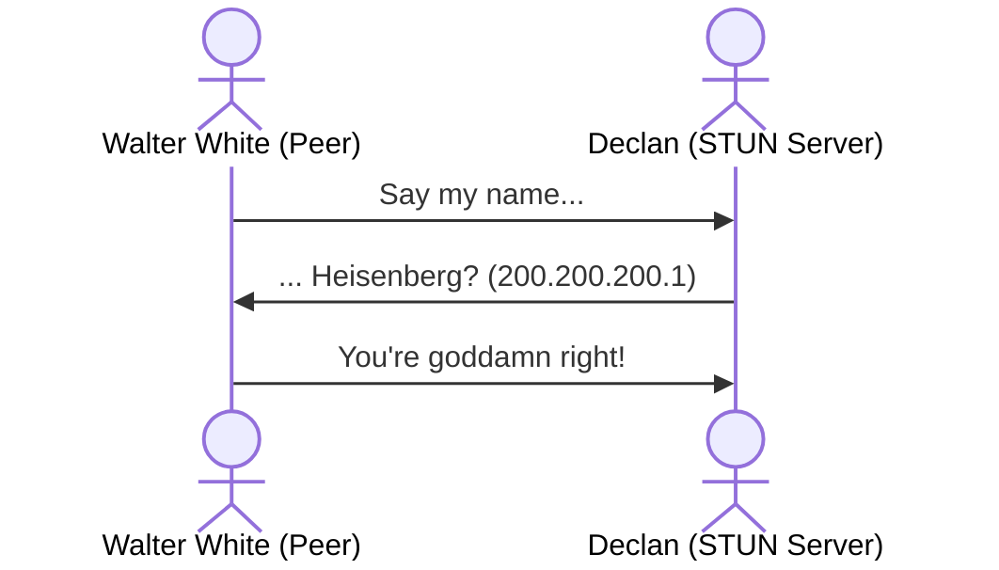
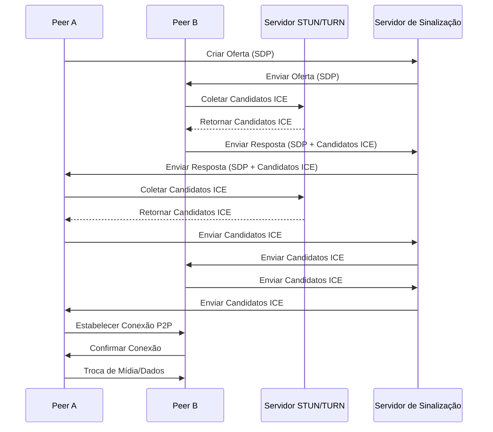
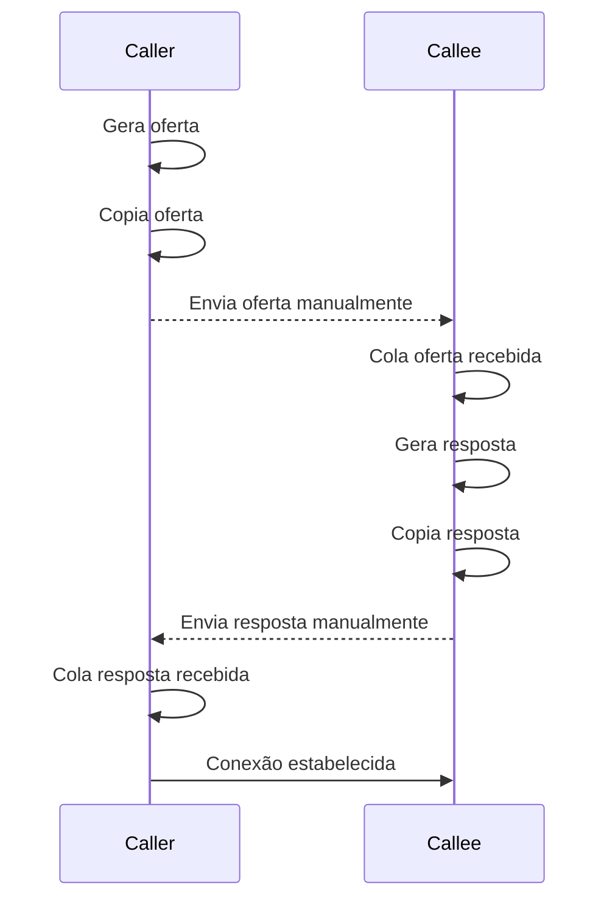

# POLI WebRTC

Esse projeto tem como objetivo explorar os desafios de conexões P2P e a solução proposta pelo WebRTC que permite a implementação de aplicações P2P com API's nativas à web. No entanto, este não é um tutorial sobre desenvolvimento web. Isso significa que não entraremos em detalhes sobre HTML, CSS, manipulação de DOM ou o ecossistema do JavaScript moderno. Em vez disso, a ideia é criar um passeio interativo pelas ideias fundamentais, de forma que qualquer pessoa com familiaridade em programação possa acompanhar, independentemente do seu conhecimento em webdev.

Espero que a leitura seja leve e interessante, e que incentive os leitores a brincar com WebRTC em seus projetos pessoais.

## TLDR

```bash
git clone https://github.com/gabrielcnegre/poli-webrtc.git
cd poli-webrtc
docker build -t poli-webrtc .
docker run -p 3000:3000 -e BASIC_AUTH="user:senha123" poli-webrtc
```

Você pode acessar duas páginas no endereço: [parte 1](http://localhost:3000/sem-signaling) e [parte 2](http://localhost:3000/com-signaling).

Comece testando a [parte 2](http://localhost:3000/com-signaling), abra multiplas abas no navegador em e veja o que acontece.

Para testar a [parte 1](http://localhost:3000/sem-signaling), abra duas abas no navegador, em uma va em "Caller" na outra em "Callee", no caller, clique em "Gerar oferta" e espere alguns segundos até receber o feedback positivo. Cole em "Receber oferta" na aba do navegador que esta em "Callee", depois clique em "Gerar resposta". Na aba "Caller" clique em receber resposta. 

## O desejo por uma conexão direta

É pandemia e o dia chegou. Depois de meses de conversas, sinais trocados e indiretas cada vez mais diretas, você finalmente tomou coragem para se declarar ao amor da sua vida. Tudo estava planejado: um encontro virtual com uma playlist cuidadosamente montada no Spotify. 

Mas então, o inimaginável acontece: Zoom está fora do ar. Desespero. Você tenta Google Meet. Nada. Discord? Também caiu. Sua única chance de confessar seu amor está escorrendo pelos seus dedos. Um pensamento brilhante (ou desesperado) surge: e se pudéssemos nos conectar diretamente? 

Sem um servidor no meio, apenas dois pares se comunicando. 

## As dificuldades de uma conexão P2P

### É tudo culpa do IP

Como aluno da Poli, você se lembra das suas aulas de redes e decide fazer um teste de sanidade. Deve ser possível se conectar com outra máquina diretamente, basta conhecer o IP. 

Para começar, abra **dois terminais** no seu computador. Em um deles, você decide abrir uma porta e escutar conexões:

```bash
nc -l 12345
```

> Atenção, algumas versões do nc requerem o parametro `-p`, então: `nc -l -p 12345`

Agora, no outro terminal, você precisa descobrir quais IPs estão disponíveis no seu computador:

```bash
ip a | grep "inet "
```

Algo parecido com isto deve aparecer:

```bash
inet 127.0.0.1/8 scope host lo
inet 192.168.1.10/24 brd 192.168.1.255 scope global eth0
```

Escolha um **IP diferente de 127.0.0.1** (que é loopback) e tente se conectar:

```bash
nc SEU_IP_PRIVADO 12345
```

Agora, digite qualquer coisa e pressione **Enter**. Você verá que a mensagem aparece no outro terminal! Funciona! Você conseguiu se conectar localmente dentro da sua rede. Tudo indica que essa abordagem pode funcionar também com seu colega que está em outro lugar, certo?

Então você compartilha o IP com seu amigo e pede para ele se conectar:

```bash
nc SEU_IP_PRIVADO 12345
```

Mas… nada acontece. Seu colega não consegue se conectar. Mas como pode ser isso? Você está na internet, consegue acessar sites normalmente, mas seu amigo não consegue se conectar diretamente a você. Isso significa que o IP que você passou para ele não é realmente o endereço pelo qual ele pode te encontrar.

### Parece que tem algo entre nós...

O problema é que, em algum momento, os provedores de internet perceberam que os endereços IPv4 não seriam suficientes para todos os dispositivos do mundo. A solução foi criar dois tipos de IP: **IP público e IP privado**. Dentro da sua casa ou empresa, cada dispositivo recebe um **IP privado**, mas, para o resto da internet, todos parecem compartilhar um único **IP público**, fornecido pelo ISP. Essa camada de separação impede conexões diretas da internet para dentro da sua rede.

E assim, sem perceber, você acaba de esbarrar em algo chamado **NAT (Network Address Translation)**. É ele que permite que múltiplos dispositivos compartilhem um único IP público. 



### Say my name

Mas, mesmo que você não saiba seu IP público, toda vez que você acessa um site, ele consegue se comunicar com você. Isso significa que **alguém do lado de fora sabe seu endereço!**

Aqui surge uma ideia: e se perguntássemos para alguém que está fora da nossa rede qual é o nosso IP público? Essa é exatamente a função de um servidor STUN (Session Traversal Utilities for NAT).

Você manda uma mensagem para o servidor STUN perguntando: "Que endereço você vê quando recebe essa mensagem?" O servidor responde com o IP público e a porta pela qual a requisição chegou. Assim, seu computador aprende como ele é visto do lado de fora e pode compartilhar essa informação com outro peer.

Podemos fazer isso perguntando para algum servidor STUN público:

```bash
curl -s https://api64.ipify.org
```

Isso retorna seu **IP público**, como um servidor STUN faria. O STUN ajuda um peer a descobrir como ele é visto externamente, permitindo compartilhar essa informação com outro peer.



### Quem pode pode, e quem não pode?

Mesmo com o STUN, você vai perceber que algumas redes bloqueiam conexões externas por questões de **segurança**, impedindo que dispositivos aceitem conexões diretas. Firewalls e NATs mais restritivos protegem os usuários, mas também dificultam a comunicação P2P.

Se a conexão direta falha, a solução é um **servidor intermediário** que retransmite as mensagens entre os peers. Esse servidor garante que os dados cheguem ao destino mesmo sem uma conexão direta.

Esse é o papel do **TURN (Traversal Using Relays around NAT)**.

### ICE ICE baby

Com esperança de confessar para seu amor, você sabe que:

1. É possível se conectar diretamente com outra máquina, basta os dois conhecerem o endereço um do outro
2. Você dificilmente sabe seu verdadeiro endereço (IP público), mas você pode perguntar para quem sabe (STUN)
3. Dependendo em que rede as máquinas residem, uma comunicação direta não vai ser permitida, seja por conta do Firewall ou da configuração do NAT. Nesses casos, será necessário fazer uso de um servidor de relay (TURN)

Para sua sorte, existe **ICE (Interactive Connectivity Establishment)**, um protocolo que foi desenvolvido para lidar justamente com os desafios que você encontrou até agora. Ele permite que dois peers se encontrem e estabeleçam uma conexão entre si:

([https://developer.mozilla.org/en-US/docs/Glossary/ICE](https://developer.mozilla.org/en-US/docs/Glossary/ICE))

O algoritmo busca sempre o caminho de menor latência para conectar os peers, testando as opções na seguinte ordem:

1. Conexão direta via UDP (nessa situação, um servidor STUN é usado apenas para descobrir o endereço externo do peer)
2. Conexão direta via TCP, usando a porta HTTP
3. Conexão direta via TCP, usando a porta HTTPS
4. Conexão indireta via um servidor relay/TURN (se todas as tentativas falharem, como no caso de um firewall bloqueando a travessia NAT)

### Se for para ser, será... e se não for, tem WebRTC para tentar todas as rotas possíveis.

Vamos lembrar por que estamos aqui: Você quer fazer uma video chamada P2P por meio do navegador, para tanto podemos usar uma API nativa da web, amplamente implementada pelos principais navegadores: WebRTC.

WebRTC é um protocolo **SRTP (Secure Real-time Transport Protocol)** que utiliza ICE, permitindo a troca de dados multimídia P2P.

Uma conexão de WebRTC envolve dois peers: um caller e um callee. O caller cria uma oferta **SDP (Session Description Protocol)**, essa oferta descreve os formatos de mídia, encoding, etc. Junto, seus candidatos ICE (possíveis caminhos de conexão). O callee recebe a oferta, e retorna uma resposta SDP. Uma vez que a conexão tenha sido estabelecida, canais bidirecionais de troca de dados podem ser estabelecidas.

O processo essencialmente envolve cada peer definir uma descrição local (sua própria) e uma remota (a do peer com quem esta se conectando).

Perceba que em nenhum momento foi mencionado como essa troca de informações é feita, e isso é proposital. O protocolo WebRTC não determina como essa troca inicial é realizada, o desenvolvedor deve escolher a maneira mais adequada para seu caso de uso. Como é descrito na documentação Mozzila "você pode usar websockets, mensagens ou pombos correio, de verdade, não importa". Na prática, é comum usar um servidor como websocket para realizar essa troca. A primeira vista isso pode soar como uma violação do P2P, mas perceba que o servidor não precisa ser central, único ou ser capaz de entender o conteúdo das mensagem, o que precisamos é de um relay.

Nota-se também que em uma implementação ideal a distinção de caller e callee é imperceptível, vamos falar disso mais pra frente.

Um diagrama simplificado do processo de negociação:



## Implementando chamada de vídeo P2P

Você ja entendeu o que precisa fazer para fazer para conversar com seu amor, agora é mão na massa. 

> Como o objetivo do tutorial é explorar os desafios de conexões P2P e a solução do WebRTC,
> eu resisti a tentação de usar typescript e uma framework de frontend para não acabar perdendo
> um leitor que não tenha familiaridade. Assim sendo, vou evitar o uso de muitas bibliotecas
> e manter a arquitetura a mais simples possível. Um projeto moderno de frontend voltado para
> produção não seria feito dessa forma.

### Quickstart

Clone o repositório

```bash
git clone https://github.com/gabrielcnegre/poli-webrtc.git
cd poli-webrtc
```

Construa a imagem

```bash
docker build -t poli-webrtc .
```

Rode o container

```bash
docker run -p 3000:3000 -e BASIC_AUTH="user:senha123" poli-webrtc
```

Agora você pode pode acessar a página da [primeira parte](http://localhost:3000/sem-signaling) e a [segunda](http://localhost:3000/com-signaling).

> O tutorial vai focar no código JS, em especial na parte do cliente e a API do WebRTC, portanto, não vou entrar em detalhes sobre manipulação de DOM, HTML, CSS etc.

### Tony Stark conseguiu construir isso em uma caverna! Com um monte de sucata!

Primeiro, vamos implementar video chamada entre dois usuários usando WebRTC sem um servidor de signaling, isso significa que os usuários vão realizar a negociação de forma manual:

1. O *Caller* acessa a aba *Caller*, clica em um botão para gerar uma oferta (será copiada para a area de transferência).
2. O *Callee* acessa a aba *Callee*, clica em um botão para colar a oferta da área de transferência.
3. O *Callee* clica em um botão para gerar a resposta (será copiada para a area de transferência).
4. O *Caller* clica em um botão para colar a resposta.

Pimba, estão conectados!



#### Servindo a Página

Para servir a página vamos usar um servidor básico no node usando express, a parte importante: 

```js
app.get("/sem-signaling", (req, res) => {
    res.sendFile(path.join(__dirname, "pages", "sem-signaling.html"));
});
```

#### Criando a conexão WebRTC

Para implementar a lógica de conexão e troca de dados, configuramos `RTCPeerConnection` com a fonte dos dados, e o que deve acontecer
nos eventos do lifetime da conexão.

Perceba que poderiamos ter passado diferentes servidores de STUN e TURN, e em uma aplicação real isso seria necessário, mas para o nosso tutorial basta o servidor de STUN público do google:

```js
const peerConnection = new RTCPeerConnection({
    iceServers: [{ urls: "stun:stun.l.google.com:19302" }]
});
```

Precisamos definir as fontes de dados que o peer connection vai usar, poderíamos por exemplo instanciar um canal de dados par mensagem, mas como queremos passar video e áudio é necessário pedir a permissão do usuário para usar sua câmera e microfone, depois configuramos a conexão para consumir esses tracks:

```js
const localStream = await navigator.mediaDevices.getUserMedia({ video: true, audio: true });
localStream.getTracks().forEach(track => peerConnection.addTrack(track, localStream));
```

Para exibir o vídeo local, definimos a propriedade de source do elemento de html video:

```js
const localVideo = document.getElementById("local-video");
localVideo.srcObject = localStream;
```

Já para o remoto, vamos avisar para o peer connection que quando
ele receber um track remoto o stream desse track deve ser a fonte
de video do elemento de video remoto. Só fazemos isso uma vez, por isso
o condicional

```js
const remoteVideo = document.getElementById("remote-video");
peerConnection.ontrack = ({ track, streams }) => {
    track.onunmute = () => {
        if (!remoteVideo.srcObject) {
            remoteVideo.srcObject = streams[0];
        }
    };
};
```

Um outro ponto importante, é que em uma negociação correta de WebRTC, 
precisamos trocar candidatos ICE até que o melhor seja encontrado, como 
não temos o signaling server, vamos simplesmente esperar até o último candidato.

Essa geração de ICE candidates ocorre (no nosso caso) apenas quando um peer está
definindo sua descriçãp (SDP) local, e nos dois casos (caller ou callee) o usuário
vai estar esperando o SDP ser colado em sua área de transferência.

```js
const onLastICECandidate = (handler) => async (event) => {
    if (event.candidate !== null) {
        console.log("Novo candidato ICE:", event.candidate);
    } else {
        console.log("Último candidato ICE gerado");
        const sdp = JSON.stringify(peerConnection.localDescription);
        await navigator.clipboard.writeText(sdp);
        handler();
    }
}
```

#### Caller

Quando o usuário clica no botão de criar a oferta, ela é criada 
e definida como a descrição local da conexão, mas ele só vai receber
o código em sua area de trensferência depois do último candidatos 
ICE.

```js
peerConnection.onicecandidate = onLastICECandidate(() => {});
const offer = await peerConnection.createOffer();
await peerConnection.setLocalDescription(offer);
```

Quando o caller receber a resposta:

```js
const answer = JSON.parse(await navigator.clipboard.readText());
await peerConnection.setRemoteDescription(answer);
```

#### Callee

O segundo peer recebe a oferta e a define como sua descrição remota:

```js
const offer = JSON.parse(await navigator.clipboard.readText());
await peerConnection.setRemoteDescription(offer);
```

Depois, ele cria uma resposta e define sua descrição local:

```js
peerConnection.onicecandidate = onLastICECandidate(() => {});
const answer = await peerConnection.createAnswer();
await peerConnection.setLocalDescription(answer);
```

Assim que seus candidatos ICE forem definidos o código será
copiado para area de transferência do usuário.

### Melhor que Skype

A esse ponto, você ja sabe o essêncial de como se conectar P2P para fazer sua confissão de amor eterno. 

Só tem um problema, e se te rejeitarem? 

Não se preocupe, você sempre pode conhecer pessoas novas. E para isso, vamos fazer uma implementação
um pouco mais realista usando um servidor de signaling, nos permitindo criar uma conferência de vídeo
com múltiplos usuários.

Essa parte do tutorial cobre o código `/com-signaling.js` e pode ser testada no endpoint `/com-signaling`. Tente abrir duas, três e quatro abas e veja o que acontece.

#### WebSockets

Para que possamos tornar o processo de conexão automático, precisamos de um servidor de sinalização, e uma tecnologia
ideal pra isso são os WebSockets, uma via de duas mãos entre cliente e servidor. Agora, apesar de não ser estritamente
P2P, vale considerar que o servidor de websockets não precisa guardar nenhuma informação sobre os usuários ou entender
as mensagens que estão sendo passadas entre eles. 

Poderiamos resolver esse problema de diversas formas, inclusive, distribuida, criando uma rede de servidores 
de websockets que se comunicam com os nós cliente.  

Para manter o signaling server o mais simples possível, vamos usar ele como um relay (ou um hub) - ele recebe mensagens
e transmite para todos menos quem mandou.

```js
const wss = new WebSocketServer({ server });
wss.on("connection", (ws) => {
    console.log("Nova conexão WebSocket");
    ws.on("message", (message) => {
        wss.clients.forEach((client) => {
            if (client !== ws && client.readyState === ws.OPEN) {
                client.send(message);
            }
        });
    });
    ws.on("close", () => {
        console.log("Conexão WebSocket fechada");
    });
});
```

#### A implementação perfeita de WebRTC

A documentação oficial do WebRTC define a "implementação perfeita", com a qual, 
não há diferença entre caller e callee. Fazemos isso defindo dois tipos de peer
em qualquer conexão, um "educado" e um "mal educado", o educado sempre desiste
de sua oferta (deixa de ser caller) quando recebe uma oferta e o mal educado 
sempre ignora uma oferta quando ja esta fazendo uma.

> Atente-se para o fato de que a forma como eu defini as mensagens, a lógica de entrada na conferência, etc, é abitrária.
> Isso é, foi uma decisão pela simplicidade do projeto e poderiam ter sido feitas de N maneiras.

Primeiro, quando um usuário entra no site ele recebe um UUID, e começa a mandar mensagens periódicas para o websocket avisando a outros peers da nossa presença:

```js
let heartbeatInterval = null;

ws.addEventListener("open", () => {
    console.log("Conexão WebSocket estabelecida.");
    const heartbeat = JSON.stringify({
        type: "heartbeat",
        from: uuid,
    })
    ws.send(heartbeat);
    heartbeatInterval = setInterval(() => {
        ws.send(heartbeat);
    }, 15000);
})

ws.addEventListener("close", () => {
    console.log("Conexão WebSocket fechada.");
    clearInterval(heartbeatInterval);
});

ws.addEventListener("message", async (event) => {
    const message = JSON.parse(await event.data.text());
    if (message.to && message.to !== uuid) return;
    await getOrCreatePeer(message.from).handleMessage(message);
})
```

Toda vez que um peer recebe uma mensagem de outro que ele não conheça,
ele cria uma nova conexão, note que vamos definir quem vai ser educado
comparando os UUID's:


```js
const remoteVideo = createVideo(remoteUUID);

let isMakingOffer = false;
const isPolite = localUUID < remoteUUID;
let ignoreOffer = false;

const connection = new RTCPeerConnection({
    iceServers: [{ urls: "stun:stun.l.google.com:19302" }]
});

for (const track of localStream.getTracks()) {
    connection.addTrack(track, localStream);
}

connection.addEventListener('track', ({ track, streams }) => {
    track.onunmute = () => {
        if (!remoteVideo.srcObject) {
            remoteVideo.srcObject = streams[0];
        }
    };
});
```

Quando não estivermos conectados o evento "negotiationneeded" é lançado,
e aqui esta o "pulo do gato": todos os peers começam criando uma oferta, 
eles começam sendo callers, a diferença é que o peer "educado" vai jogar
fora sua oferta caso receba uma antes, cedendo sua posição de caller.

```js
connection.addEventListener('negotiationneeded', async () => {
    try {
        isMakingOffer = true;
        await connection.setLocalDescription();
        ws.send(JSON.stringify({
            type: 'description',
            from: localUUID,
            to: remoteUUID,
            description: connection.localDescription,
        }));
    } catch (error) {
        console.error('Erro na negociação:', error);
    } finally {
        isMakingOffer = false;
    }
});
```

Lembra que na versão manual usavamos o último candidato? Agora podemos
fazer a troca, sempre buscando novos candidatos:

```js
connection.addEventListener('icecandidate', (event) => {
    if (event.candidate) {
        ws.send(JSON.stringify({
            type: 'candidate',
            from: localUUID,
            to: remoteUUID,
            candidate: event.candidate,
        }));
    }
});

connection.addEventListener('iceconnectionstatechange', () => {
    if (connection.iceConnectionState === 'failed') {
        connection.restartIce();
    }
});
```

Quando o peer recebe uma descrição:

```js
const handleDescription = async (description) => {
    try {
        const isOfferDescription = description.type === "offer";
        const isSignalingStable = connection.signalingState === "stable";
        const isOfferCollision = isOfferDescription && (isMakingOffer || !isSignalingStable);
        ignoreOffer = !isPolite && isOfferCollision;

        if (ignoreOffer) return;

        await connection.setRemoteDescription(description);
        if (isOfferDescription) {
            await connection.setLocalDescription();
            ws.send(JSON.stringify({
                type: "description",
                from: localUUID,
                to: remoteUUID,
                description: connection.localDescription
            }));
        }
    } catch (err) {
        console.error(err);
    }
}
```

Quando recebe um candidato:

```js
const handleCandidate = async (candidate) => {
    try {
        await connection.addIceCandidate(candidate);
    } catch (err) {
        if (!ignoreOffer) console.error(err);
    }
}
```

## Reflexões

O objetivo deste projeto é puramente exploratório e pedagógico, portanto, obviamente, não é adequado para uma aplicação real. Mas por quê, exatamente? Onde ele falha primeiro? (Tirando os crimes contra a humanidade cometidos em relação a segurança)

Com o último exemplo, temos uma oportunidade interessante para refletirmos sobre os desafios das conexões P2P, especialmente em relação à escalabilidade e à tolerância a falhas.

Primeiramente, observe que a topologia utilizada é uma "mesh", onde todos os pares se conectam diretamente uns aos outros, enquanto o servidor WebSocket mantém conexões simultâneas com todos. Isso não é necessariamente ruim, mas apresenta um desafio significativo de escalabilidade: à medida que o número de pares cresce, o número de conexões cresce exponencialmente. Será que essa abordagem se sustentaria em um ambiente com centenas de usuários? Como lidaríamos com a sobrecarga de conexões?

Outra: será que o servidor de signaling não pode filtrar as mensagens e mandar só pra quem importa?

Além disso, vale refletirmos sobre a tolerância a falhas. O que acontece se um peer cair? Como os outros pares lidariam com isso? Se um usuário estiver atrás de um NAT mais restritivo ou com conectividade instável, sua participação na rede P2P pode ser comprometida. Para aplicações reais, técnicas como supernodes, NAT traversal avançado e redes híbridas (com nós centrais gerenciando a conectividade) são frequentemente empregadas para mitigar esses problemas.

Ao explorar essas questões, conseguimos compreender melhor os limites e desafios do WebRTC e das arquiteturas descentralizadas. E você, como resolveria esses problemas em um sistema real?


