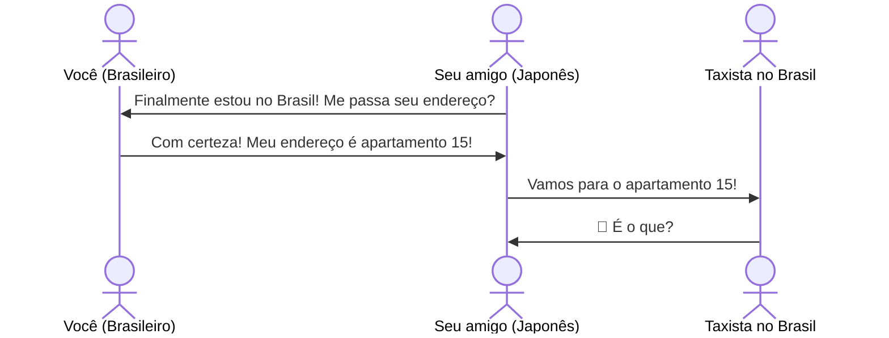
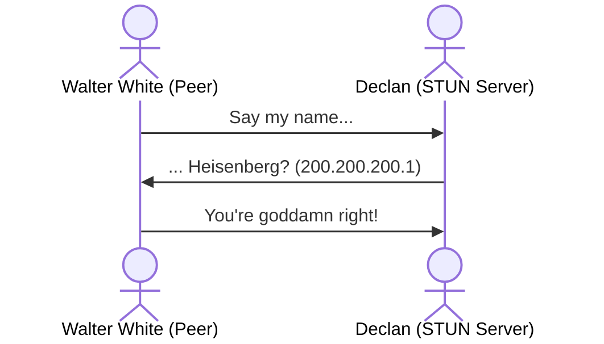
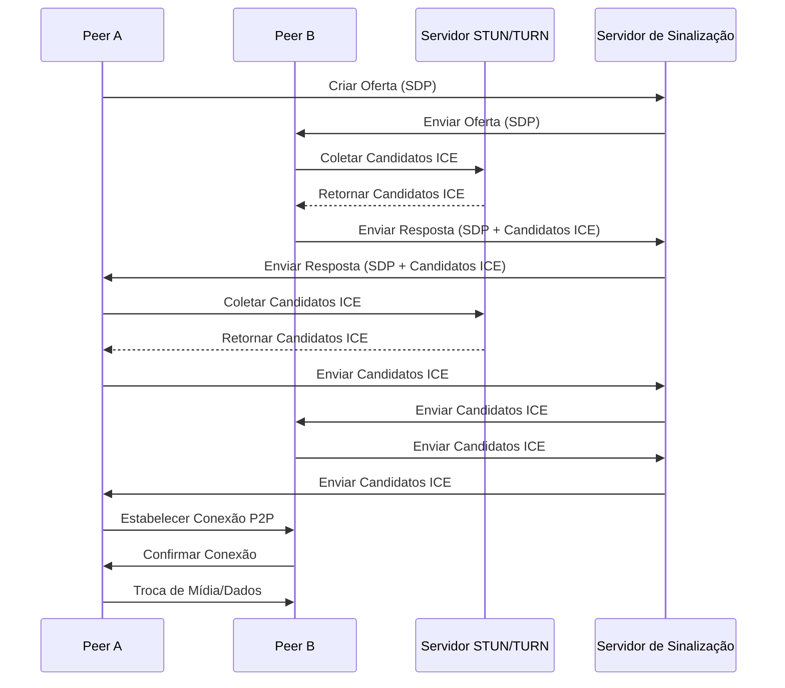

## O desejo por uma conexão direta

É pandemia e o dia chegou. Depois de meses de conversas, sinais trocados e indiretas cada vez mais diretas, você finalmente tomou coragem para se declarar ao amor da sua vida. Tudo estava planejado: um encontro virtual com uma playlist cuidadosamente montada no Spotify. 

Mas então, o inimaginável acontece: Zoom está fora do ar. Desespero. Você tenta Google Meet. Nada. Discord? Também caiu. Sua única chance de confessar seu amor está escorrendo pelos seus dedos. Um pensamento brilhante (ou desesperado) surge: e se pudéssemos nos conectar diretamente? 

Sem um servidor no meio, apenas dois pares se comunicando. 

## As dificuldades de uma conexão P2P

### É tudo culpa do IP

Como aluno da Poli, você se lembra das suas aulas de redes e decide fazer um teste de sanidade. Deve ser possível se conectar com outra máquina diretamente, basta conhecer o IP. 

Para começar, abra **dois terminais** no seu computador. Em um deles, você decide abrir uma porta e escutar conexões:

```bash
nc -l 12345
```

Agora, no outro terminal, você precisa descobrir quais IPs estão disponíveis no seu computador:

```bash
ip a | grep "inet "
```

Algo parecido com isto deve aparecer:

```bash
inet 127.0.0.1/8 scope host lo
inet 192.168.1.10/24 brd 192.168.1.255 scope global eth0
```

Escolha um **IP diferente de 127.0.0.1** (que é loopback) e tente se conectar:

```bash
nc SEU_IP_PRIVADO 12345
```

Agora, digite qualquer coisa e pressione **Enter**. Você verá que a mensagem aparece no outro terminal! Funciona! Você conseguiu se conectar localmente dentro da sua rede. Tudo indica que essa abordagem pode funcionar também com seu colega que está em outro lugar, certo?

Então você compartilha o IP com seu amigo e pede para ele se conectar:

```bash
nc SEU_IP_PRIVADO 12345
```

Mas… nada acontece. Seu colega não consegue se conectar. Mas como pode ser isso? Você está na internet, consegue acessar sites normalmente, mas seu amigo não consegue se conectar diretamente a você. Isso significa que o IP que você passou para ele não é realmente o endereço pelo qual ele pode te encontrar.

### Parece que tem algo entre nós...

O problema é que, em algum momento, os provedores de internet perceberam que os endereços IPv4 não seriam suficientes para todos os dispositivos do mundo. A solução foi criar dois tipos de IP: **IP público e IP privado**. Dentro da sua casa ou empresa, cada dispositivo recebe um **IP privado**, mas, para o resto da internet, todos parecem compartilhar um único **IP público**, fornecido pelo roteador. Essa camada de separação impede conexões diretas da internet para dentro da sua rede.

E assim, sem perceber, você acaba de esbarrar em algo chamado **NAT (Network Address Translation)**. É ele que permite que múltiplos dispositivos compartilhem um único IP público. Mas, ao mesmo tempo, ele também impede que conexões externas cheguem diretamente até você.



### Say my name

Mas, mesmo que você não saiba seu IP público, toda vez que você acessa um site, ele consegue se comunicar com você. Isso significa que **alguém do lado de fora sabe seu endereço!**

Aqui surge uma ideia: e se perguntássemos para alguém que está fora da nossa rede qual é o nosso IP público? Essa é exatamente a função de um servidor STUN (Session Traversal Utilities for NAT).

Você manda uma mensagem para o servidor STUN perguntando: "Que endereço você vê quando recebe essa mensagem?" O servidor responde com o IP público e a porta pela qual a requisição chegou. Assim, seu computador aprende como ele é visto do lado de fora e pode compartilhar essa informação com outro peer.

Podemos fazer isso perguntando para algum servidor STUN público:

```bash
curl -s https://api64.ipify.org
```

Isso retorna seu **IP público**, como um servidor STUN faria. O STUN ajuda um peer a descobrir como ele é visto externamente, permitindo compartilhar essa informação com outro peer.



### Quem pode pode, e quem não pode?

Mesmo com o STUN, você vai perceber que algumas redes bloqueiam conexões externas por questões de **segurança**, impedindo que dispositivos aceitem conexões diretas. Firewalls e NATs mais restritivos protegem os usuários, mas também dificultam a comunicação P2P.

Se a conexão direta falha, a solução é um **servidor intermediário** que retransmite as mensagens entre os peers. Esse servidor garante que os dados cheguem ao destino mesmo sem uma conexão direta.

Esse é o papel do **TURN (Traversal Using Relays around NAT)**.

### ICE ICE baby

Agora você tem uma esperança para se conectar com seu amor, você sabe que:

1. É possível se conectar diretamente com outra máquina, basta os dois conhecerem seu endereço
2. Você dificilmente sabe seu verdadeiro endereço (IP público), mas você pode perguntar para quem sabe (STUN)
3. Dependendo em que rede as máquinas residem, uma comunicação direta não vai ser permitida, seja por conta do Firewall ou da configuração do NAT. Nesses casos, será necessário fazer uso de um servidor de relay (TURN)

Para sua sorte, existe **ICE (Interactive Connectivity Establishment)**, um protocolo que foi desenvolvido para lidar justamente com os desafios que você encontrou até agora. Ele permite que dois peers se encontrem e estabeleçam uma conexão entre si:

([https://developer.mozilla.org/en-US/docs/Glossary/ICE](https://developer.mozilla.org/en-US/docs/Glossary/ICE))

O algoritmo busca sempre o caminho de menor latência para conectar os peers, testando as opções na seguinte ordem:

1. Conexão direta via UDP (nessa situação, um servidor STUN é usado apenas para descobrir o endereço externo do peer)
2. Conexão direta via TCP, usando a porta HTTP
3. Conexão direta via TCP, usando a porta HTTPS
4. Conexão indireta via um servidor relay/TURN (se todas as tentativas falharem, como no caso de um firewall bloqueando a travessia NAT)

### Se for para ser, será... e se não for, tem WebRTC para tentar todas as rotas possíveis.

No fim das contas você quer fazer uma video chamada P2P por meio do navegador, para tanto podemos usar uma API nativa da web, amplamente implementada pelos principais
navegadores - WebRTC.

WebRTC é um protocolo **SRTP (Secure Real-time Transport Protocol)** que utiliza ICE para administrar a conexão, permitindo a troca de dados multimídia P2P.

Uma conexão de WebRTC envolve dois peers: um caller e um callee. O caller cria uma oferta **SDP (Session Description Protocol)**, essa oferta descreve os formatos de mídia, encoding, etc. Junto, seus candidatos ICE (possíveis caminhos de conexão). O callee recebe a oferta, e retorna uma resposta SDP. Uma vez que a conexão tenha sido estabelecida, canais bidirecionais de troca de dados podem ser estabelecidas.

Perceba que em nenhum momento foi mencionado como essa troca de informações é feita, e isso é proposital. O protocolo WebRTC não determina como essa troca inicial é realizada, o desenvolvedor deve escolher a maneira mais adequada para seu caso de uso. Como é descrito na documentação Mozzila "você pode usar websockets, mensagens ou pombos correio, de verdade, não importa". Na prática, é comum usar um servidor com websocket para realizar essa troca. A primeira vista isso pode soar como uma violação do P2P, mas perceba que o servidor não precisa ser central, único ou ser capaz de entender o conteúdo das mensagem, o que precisamos é de um relay.

Nota-se também que em uma implementação ideal a distinção de caller e callee é imperceptível, vamos falar disso mais pra frente.

Um diagrama simplificado do processo de negociação:



## Implementando chamada de vídeo P2P

Você ja entendeu o que precisa fazer para fazer para conversar com seu amor, agora é mão na massa. 

> **Nota do autor**
> Como o objetivo do tutorial é explorar os desafios de conexões P2P e a solução do WebRTC,
> eu resisti a tentação de usar typescript e uma framework de frontend para evitar explicar o processo de saffolding e build
> e acabar perdendo um leitor que não tenha familiaridade. Assim sendo, daqui pra frente vou tentar não usar muitas bibliotecas
> e manter a arquitetura a mais simples possível. Um projeto moderno de frontend voltado para produção não seria feito dessa forma.

### Tony Stark conseguiu construir isso em uma caverna! Com um monte de sucata!


